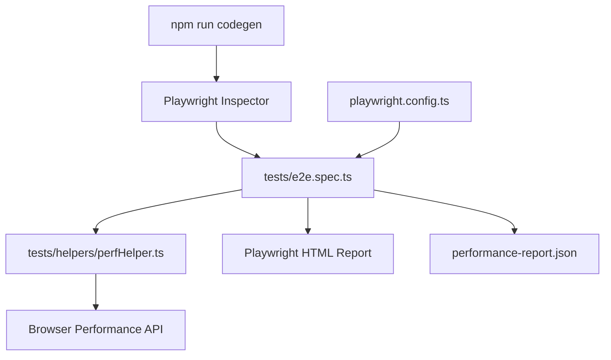

# System Patterns

## Architecture Overview



## Key Design Patterns

### 1. Inject-then-Observe Pattern
`injectPerformanceObserver()` uses `page.addInitScript()` to inject a `PerformanceObserver`
**before** any navigation happens. This ensures all browser-emitted entries (longtask, paint,
layout-shift) are captured from the very first frame.

### 2. Mark-Action-Measure Pattern
Every user interaction is wrapped in a triplet:
```
markActionStart(page, name)  →  action()  →  waitForLoadState()  →  markActionEnd(page, name)
```
This uses the W3C `performance.mark()` / `performance.measure()` API for sub-millisecond accuracy
directly in the browser's timeline — not approximated from the Node.js side.

### 3. Codegen-First Workflow
Selectors are **never written manually**. `playwright codegen` generates them by observing
real user interactions. Generated code is pasted into `measureRender()` wrappers.

### 4. Single-Worker Sequential Execution
`workers: 1` in `playwright.config.ts` ensures tests run sequentially, eliminating CPU
contention noise that would corrupt rendering time measurements.

### 5. Report Aggregation
All `RenderTiming` objects are accumulated in the `timings[]` array and then passed to
`buildReport()` + `printReport()` at the end of the test. The JSON is attached to the
Playwright HTML report via `test.info().attach()`.

## Component Relationships

| File | Role |
|------|------|
| [`playwright.config.ts`](../playwright.config.ts) | Chromium config, reporters, BASE_URL, timeout |
| [`tests/e2e.spec.ts`](../tests/e2e.spec.ts) | Main test — paste codegen output here |
| [`tests/helpers/perfHelper.ts`](../tests/helpers/perfHelper.ts) | All performance measurement utilities |
| [`scripts/codegen.ps1`](../scripts/codegen.ps1) | PowerShell launcher for codegen with instructions |

## Performance Metrics Collected Per Action

| Metric | Source | Meaning |
|--------|--------|---------|
| `duration` | `performance.measure()` | Time from click → page settled (ms) |
| `longTaskCount` | `PerformanceObserver(longtask)` | JS tasks blocking main thread >50ms |
| `layoutShiftScore` | `PerformanceObserver(layout-shift)` | CLS — visual instability score |
| `paintEntries` | `PerformanceObserver(paint)` | FP and FCP timestamps |
| Navigation Timing | `getEntriesByType('navigation')` | TTFB, DOM load, full load |

## Slow Action Threshold
Actions taking **>300ms** are flagged as slow in the report summary.
This threshold can be changed in [`tests/e2e.spec.ts`](../tests/e2e.spec.ts) (the `> 300` filter in `buildReport`).
